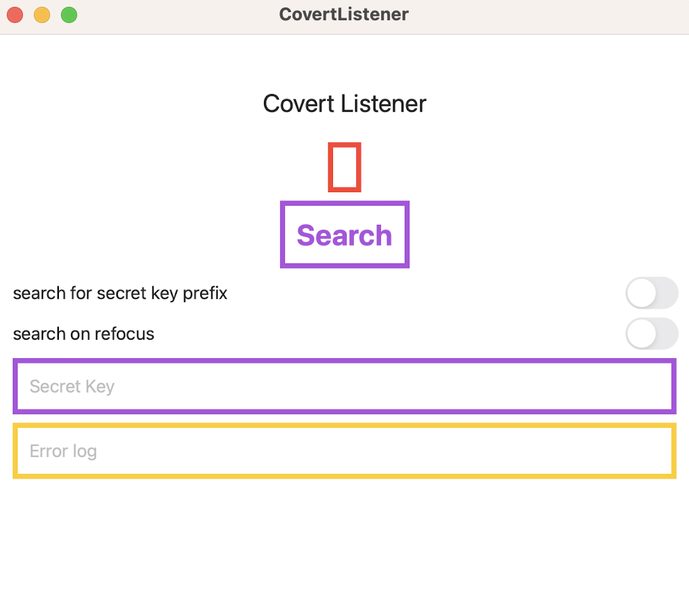
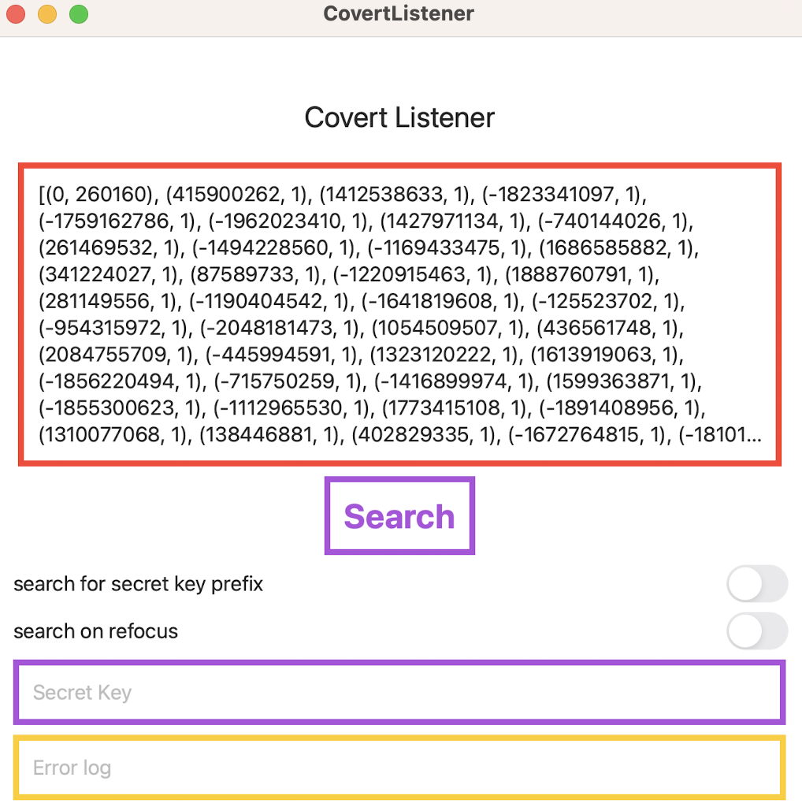
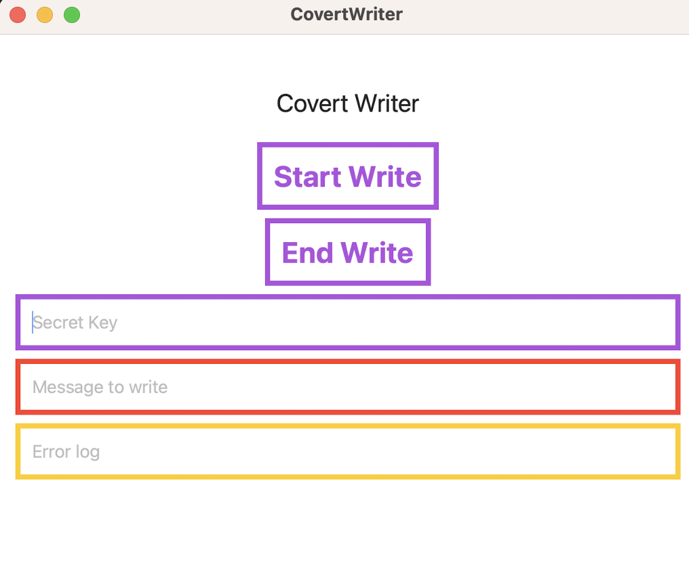
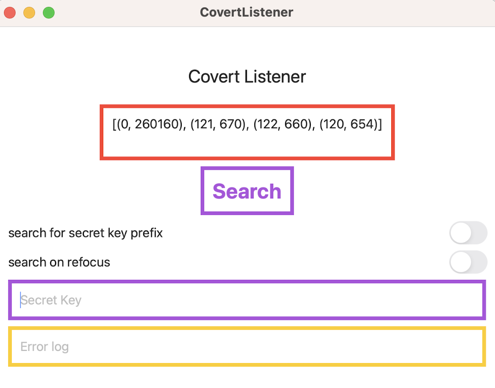
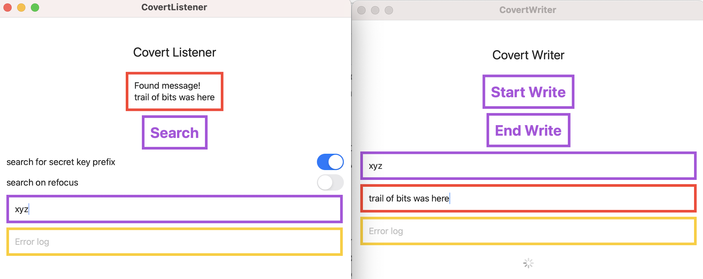

# LeftoverLocals Apple App

This project contains two Apple applications: a CovertListener and a CovertWriter. The host code is written in Swift and the GPU code goes through Apple's Metal framework. The app can be deployed both on Mac OS devices (laptops and desktops) as well as on mobile devices (iPad and iPhone). The apps work as a pair: the CovertListener tries to observe values written by the CovertWriter when running at the same time (or as close as possible). 

## Building and deploying

There are two directories, `CovertListener` and `CovertWriter`. Each directory contains an Xcode project file (with the `xcodeproj` extension), which can be opened with Xcode. 

Once in Xcode, these projects can be built and deployed. We have tested the apps on an iPad Air Gen 3, iPhone 12, and both M1 and M2 laptop computers. 

These apps have the same constraints as any other Apple App, for example, you must have a developer account; your device must be configured to allow apps to be deployed; you can only have two apps deployed at a time for standard account, etc.

## Running

### Dumping Local Memory

The CovertListener can be used to dump local memory. The CovertListener has the following GUI:

Press the Search button to perform a dump of threadgroup (or local) memory. The result of the dump is given as a histogram of observed values and displayed in the top red box. Each histogram element is given as a tuple `(OBSERVATION, NUMBER OF OBSERVATIONS)`, e.g., the output `(123, 500)` means that the value `123` was seen 500 times. The values are sorted by the most frequently observed. An example of what you might see on an M2 Macbook Air looks as follows:

There are many instances of zero appearing (260160 of them), but there are many non-zero values as well.

### Writing Canary Values

The CovertWriter can be used to write canary values to local memory. The CovertWrier has the following GUI:

To write some canary values, type some ascii characters in the purple box (the "secret key" box) and in the red box (the "message to write" box). For example, type `xyz` in both boxes. Then press "Start Write". This will repeatedly write the ascii values 120, 121, and 122 to GPU local memory. There will be a circular visual progress indicator that appears while the CovertWriter is writing to the GPU. If "End Write" is pressed, then the CovertWriter will stop writing to the GPU and visual progress indicator will stop.

### Observing Canary Values

While the CovertWriting is writing (e.g., `xyz`), perform a memory dump with the listener. Running these two apps together is not always straight forward; here is how we have done it for different systems. Videos of each techniques are also provided at the end.

* On Mac OS (laptops and desktops) the apps can simply be run at the same time.
* On an iPad, the apps can be run in [split screen mode](https://support.apple.com/en-us/HT207582).
* On an iPhone, the CovertWriter app can be run, and then the focus can be switched to the CovertListener. In the CovertListener select the option to "search on refocus" to perform a local memory dump as soon as the app comes in focus.

If the GPU is vulnerable to LeftoverLocals, then the CovertListener will be able to observe canary values. In our example, this was the ascii values 120, 121, and 122. The following is a result from a M2 Macbook Air, which has the LeftoverLocals vulnerability:

Different systems may observe canary values less frequently than others. We have found that the iPhone might require a few iterations of switching between the CovertListener and the CovertWriter while the CovertWriter is writing to memory and while the "search on refocus" option is set on the CovertListener.

### Sending a Secret Message

Now we illustrate how the two apps can work together so that the CovertWriter can send a secret message to the CovertLister. First, agree on a secret key. For example `xyz`. Put this in the purple box for both Apps. Then think of a secret message for the CovertWriter. For example: "trail of bits was here". At this point, the CovertWriter can start writing. 

Next, select the option in the CovertListener to "search for secret key prefix". Now run the apps together as described in the section "Observing Canary Values". The CovertListener can often find the secret message from the CovertWriter in many of our experiences. The following screenshot shows both apps together with the message found. 

### Secure Behavior

We would expect a secure device/framework combination to not allow covert communication between two apps. Additionally, we show in our PoCLLMAttack project that GPU local memory can even obtain sensitive information for ML applications that a listener app can gain access too. Ideally, a secure system would only show the value zero when local memory is dumped (e.g., in the CovertListener app). This is what we observe for Nvidia, Imagination, and Intel devices. Additionally, we observe this when using WebGPU, even on Apple devices that we observe LeftoverLocals on through the Metal framework. 

## Videos

* A narrated video of the app running on an iPad 3rd Gen is provided in LeftoverLocalsAppleAppiPad.mp4. This video illustrates the CovertListener and the CovertWriter running next to each other in the iPad app split mode.
* A non-narrated video of the app running on an iPhone 12 is provided in LeftoverLocalsAppleAppiPhone.mp4. Because the iPhone doesn't support the split mode, this video shows how the CovertLister and CovertWriter can be swapped in and out of focus.
* A non-narrated video of the app runnning on a Macbook Air M2 is provided in LeftoverLocalsAppleAppM2.mp4. Mac OS supports many applications running at once, and thus, the CovertListener and CovertWriter can be run at the same time.