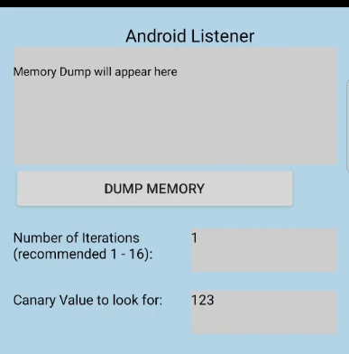
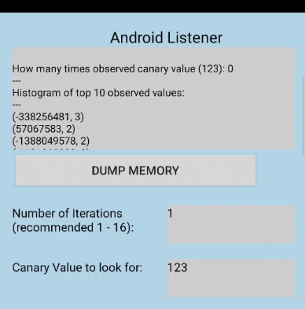
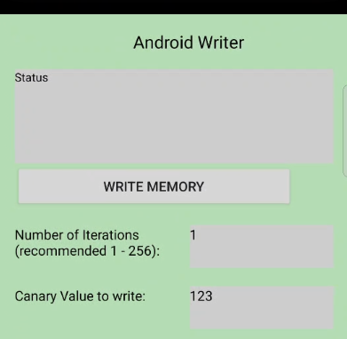
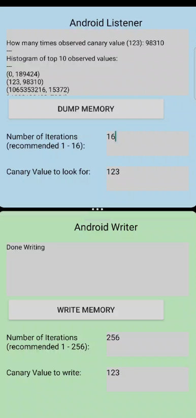

# LeftoverLocals Vulkan Android Apps
This project contains two Android apps: a covertVKListener and a covertVKWriter. The frontend is writen in Kotlin; it then calls into C++ code using JNI, which then utilizes Vulkan to write canary values to local memory and perform memory dumps. The Vulkan aspect is very similar to the VulkanCLI project. The two apps work as a pair: the covertVKListener tries to observe values written by the covertVKWriter when running at the same time (or as close as possible).

## Building and deploying

### APKs
For convenience, this repo contains pre-built APKs (located in the APK directory), which you can use to install the apps. This is the easiest way to obtain the apps if you do not want to modify anything.

### Building from source
To build and deploy the projects, open the root directory of the app (`covertVKListener` or `covertVKWriter`) in Android Studio. From there, you should be able to build and deploy like any other Android app.

### Updating kernels
To update the kernels used in the apps, navigate to the `kernels` directory. The kernels are written in OpenCL C, which are then compiled to SPIR-V using [clspv](https://github.com/google/clspv). Additionally, the kernels have non-semantic info stripped using `spirv-opt` (which is part of [SPIRV-tools](https://github.com/KhronosGroup/SPIRV-Tools). To modify the kernels, both programs are required. The non-semantic info is stripped so that we can run the apps on older Android devices before this extension was widely supported.

The kernels for the covertVKListener and covertVKWriter are in `kernels/covertListener.cl` and `kernels/covertWriter.cl` respectively. To update the android apps with new kernels, run the bash script `updateKernels.sh` (we have only verified that this works on a Linux CLI).

## Running

### Dumping Local Memory
The covertVKListener can be used to dump local memory. it has the following GUI:

Press the "DUMP MEMORY" button to perform a dump of local memory. The result of the dump is given as a histogram of observed values and displayed in the top grey box. Each histogram element is given as a tuple (OBSERVATION, NUMBER OF OBSERVATIONS), e.g., the output (123, 500) means that the value 123 was seen 500 times. The values are sorted by the most frequently observed. An example of what you might see is given below (taken from an HTC OnePlus 11, with a Qualcomm Snapdragon 8 2nd Gen SoC)

We see many instances of non-zero values, although no particular value is appearing with a high frequency (the top observed value only appears 3 times).

### Writing Canary Values
The CovertWriter can be used to write canary values to local memory. The CovertWrier has the following GUI:

To a canary values, type an integer value into the box next to the prompt "Canary Value to write". The default is `123`, and it can be left as-is. Then press "WRITE MEMORY". This will write the canary value to local memory on the GPU. The number of times that the writing kernel repeats can be specified in the box next to the "Number of Iterations" prompt. As suggested, it is recommended to put this between 1 and 256 (with a higher number being generally more effective at observing the vulnerability). 

When "WRITE MEMORY" is pressed, the grey box at the box will indicate "Starting to Write". When it is finished, the box will display "Done Writing". For a high value, the app GUI will freeze while the writing is happening. This is expected and could fixed in the app by dispatching the memory writing routine to another thread. 

### Observing Canary Values
Run the two apps side-by-side by using Android's app split screen feature (see the video demo at the bottom of this page for reference). While the writer is writing the canary value (i.e., when the "WRITE MEMORY" button is pressed), check to see if the listener is able to observe the canary value by pressing "DUMP MEMORY". 

The listener can be configured to look for a specific value by putting the value in the box next to the text: "Canary Value to look for". By default it is set to `123` to match the writer. For each output in the listener, the first line states how many times the canary value was observed.

To perform more memory dumps iteratively, the listener can be configured to perform several memory dump kernels and accumulate the results before displaying them. These iterations can be specified in the box next to the prompt "Number of Iterations". As suggested, this should be between 1 and 16, as these take significantly longer than memory writes. 

In our experience, we set the writer iterations to 256 and the listener iterations to 16. Perform the experiment several times to see if the listener ever reports observing the canary value. If the listener observes the canary value when run next to the writer, we say the device has the LeftoverLocal vulnerability. 

Below is a screen shot of the app observing the vulnerability on the HTC OnePlus 11 device:

## Secure Behavior
We would expect a secure device/framework combination to not allow this memory leaking between two apps. Additionally, we show in our PoCLLMAttack project that GPU local memory can even obtain sensitive information for ML applications that a listener app can gain access too. Ideally, a secure system would only show the value zero when local memory is dumped (e.g., in the covertVKListener app). This is what we observe for Nvidia, Imagination, and Intel devices. Additionally, we observe this when using WebGPU, even when using devices that have been shown to have the LeftoverLocal vulnerabililty. 

## Videos
* A narrated video of the app running on an HTC OnePlus 11 is provided in LeftoverLocalsHTCOnePlus.mp4. We show that this device has the LeftoverLocal vulnerability.
* A narrated video of the app running on a Google Pixel 6 is provided in LeftoverLocalsPixel6.mp4. We show that while this device does not have show the canary values in the covertVKListener, it does show non-zero values.

